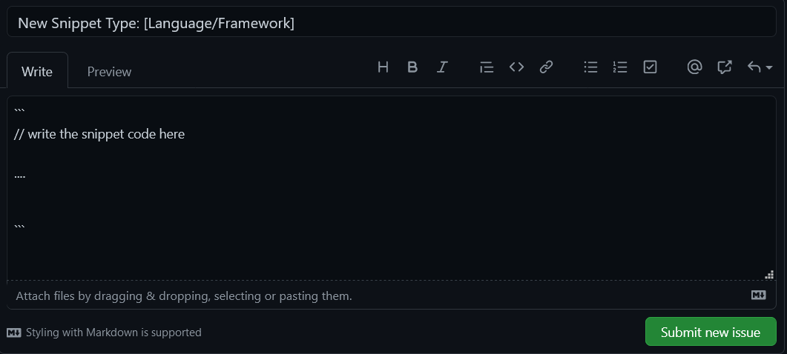

# Contributing

### You would like to contribute your own snippet? Fantastic

Currently we are accepting the following:

- Django
- Python
- Vue JS
- React JS
- React Typescript

### Guidance:

1. Make sure your new snippet is not just a re-write of another.
2. Make sure your new snippet is truly new
3. Please don't alter other snippets :3 thank you
4. If you're not sure feel free to submit an issue and ask any questions

If you would like to submit a different snippet. Please submit an issue like so:



Hit submit and wait for your snippet to be added.

### Adding to an existing snippet group?

1. Fork the [Repo](https://github.com/MeRichard123/RichSnippits) to your account.

2. Navigate to your new forked version.

3. Clone locally with `git clone https://github.com/yourname/RichSnippits.git`

4. In the new directory add an upstream branch.

   - `git remote add upstream https://github.com/MeRichard123/RichSnippits.git`
   - Now upstream points back to the original and origin points to your fork.

5. Run locally with:

<code-group>

<code-block title="NPM">
```bash
npm i && npm run dev
```
</code-block>

</code-group>

6. Now you can navigate to src/snippets and add to the designated markdown file.

   - Be sure to add a description of the snippet and then the code block.
   - If you're unsure use the existing code snippets as a template.

7. Add your changes to a new branch and giving your change a name. For example:
   ```bash
       git checkout main
       git add .
       git commit -m "Your commit message"
       git pull upstream master && git push -u origin master
       git checkout -b hotfix/name-of-change
   ```
8. Now create the pull request: `git push -u origin hotfix/name-of-change`

9. Open the repository on github and hit the new pull request button which should have appeared.

10. Add a short description and hit: "create pull request".

11. Finally, wait for review.

#### Thank you for your contribution! You will sure help many people in this way. Let's learn together
